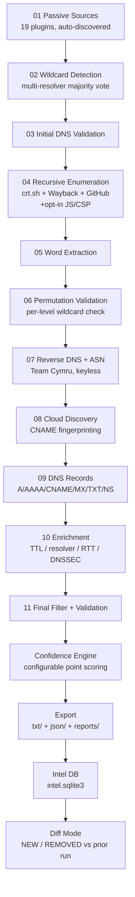

# Architecture

## Pipeline flow



Every stage is wrapped by `Pipeline._stage_cached`, which:

## Module layout

`pipeline.py` is the orchestrator (sequences the 11 stages, owns
checkpointing/caching/metadata) -- implementation details it delegates to:

| Module | Responsibility |
|---|---|
| `dns_utils.py` | Wildcard detection, core DNS validation (`dns_validate_batch`), reverse DNS (PTR) |
| `enrichment.py` | ASN lookup (Team Cymru), cloud/CDN fingerprinting, full DNS record-set collection -- split out of `dns_utils.py` since these are enrichment layered on top of already-validated hosts, not part of the validate/filter path |
| `recursion_expanders.py` | The crt.sh / Wayback / GitHub / JS-CSP recursive-expansion functions -- split out of `pipeline.py` so the orchestrator doesn't carry every expansion strategy's implementation inline |
| `http_utils.py` | Shared retry/backoff HTTP helper + `HTTPSourceError` |
| `sources/_cli_helpers.py` | Shared subprocess helper + `CLISourceError` for CLI-tool-based sources |
| `metadata.py` | Per-host metadata store + the configurable confidence engine |
| `intel_db.py` | SQLite run history (separate from `cache.sqlite3`) |
| `diff.py` | NEW/REMOVED comparison against a prior run |
| `exporters.py` | Every output format (`txt/`, `json/`, `reports/`) + cleanup modes |
| `progress.py` | tqdm-or-fallback progress reporting for batch stages |
| `cli.py` | Argument parsing, key resolution, per-domain orchestration, logging setup |


1. Checks `output/checkpoints/<stage>.json` -- if present and `--resume` was
   passed, loads it instead of recomputing.
2. Otherwise runs the stage, times it, records success/failure/errors via
   `MetricsCollector`, and checkpoints the raw result.
3. Stores the raw result in `self.stage_snapshots[stage_name]` regardless of
   which path was taken -- this is what lets the exporter dump one JSON file
   per stage into `output/json/` after the run, without re-running anything.

### Resume granularity

Resume is **per-stage**, not mid-stage: if you Ctrl+C during stage 4
(recursive enumeration), stages 01-03 are already checkpointed and will be
skipped on `--resume`; stage 4 itself restarts from scratch. `cli.py` catches
`KeyboardInterrupt` around `pipeline.run()`, logs exactly which stages
completed, and prints the exact `--resume` command to continue. True
mid-stage resume (e.g. resuming a partially-completed DNS validation batch)
isn't implemented -- stages are the unit of restart, matching the
checkpoint file granularity `output/checkpoints/` already exposes.

## Plugin SDK

Every source is a subclass of `Source` (`subdomain_recon/sources/base.py`):

```python
class Source:
    name: str = "unnamed"
    confidence: str = "Low"           # High / Medium / Low (informational label)
    requires_cli: str | None = None   # external binary this source needs, if any
    requires_key: str | None = None   # key in ctx.api_keys this source needs, if any

    def available(self, ctx: SourceContext) -> bool: ...
    def fetch(self, domain: str, ctx: SourceContext): ...  # -> iterable[str]
```

`fetch()` returns raw hostname strings in whatever shape the upstream API
gives them -- the pipeline's `normalize_hostname()` handles cleanup
(lowercasing, stripping scheme/port/wildcard markers, validating shape), so
plugins don't need to.

### Auto-discovery (already in place)

`subdomain_recon/sources/__init__.py` walks every `.py` file in the
`sources/` package with `pkgutil.iter_modules`, imports it, and registers
every `Source` subclass it finds by `inspect.getmembers`. **Adding a new
source is drop-a-file, not edit-core-code**:

```python
# subdomain_recon/sources/my_source.py
from .base import Source, SourceContext

class MySource(Source):
    name = "my_source"
    confidence = "Medium"

    def fetch(self, domain, ctx: SourceContext):
        return [f"host1.{domain}", f"host2.{domain}"]
```

`python3 run.py --list-plugins` picks it up with zero other changes. This
was already true before this round of changes -- it's flagged "done" in the
checklist below rather than newly built.

## Confidence engine

Additive, explainable point scoring (`subdomain_recon/metadata.py`):

| Condition | Default points |
|---|---|
| 2+ independent sources | +20 |
| DNS valid (always true for final hosts) | +20 |
| Discovered via recursive expansion | +15 |
| Cloud/CDN fingerprint matched | +10 |
| A GitHub-based source found it | +15 |
| crt.sh (direct or recursive) found it | +10 |
| **Only** source is permutation (guessed, not observed) | -15 |

Score is clamped to `[0, 100]`; label thresholds are High >= 70, Medium >=
40, else Low. Every host's `confidence_breakdown` in `reports/report.json`
shows exactly which conditions fired -- no black-box averaging.

**Override any weight** without touching code, via `--config-file`:

```json
{ "confidence_weights": { "cloud": 20, "permutation_penalty": -25 } }
```

Unspecified keys keep their default (merged on top of
`DEFAULT_CONFIDENCE_WEIGHTS`, not a full replacement).

## Provider health

Tracked per source during stage 01 (`Pipeline.provider_health`): status is
one of `ok` (ran, with a host count -- 0 is a valid, non-error outcome),
`skipped` (unavailable -- missing key or CLI binary, with which one named),
or `error` (an exception escaped `fetch()`). Rendered as a formatted summary
both in `reports/report.md` and printed at the end of every CLI run
(`exporters.format_provider_summary`). Duplicate-mention counting (raw
per-source host mentions minus unique hosts) is tracked alongside it.

**Update:** the limitation above was fixed in a later pass. Every source
(HTTP-based via `require_ok_response` in `http_utils.py`, CLI-based via
`run_cli_and_get_lines` in `sources/_cli_helpers.py`) now raises
(`HTTPSourceError` / `CLISourceError`) on a real failure -- non-2xx status,
connection failure, non-zero exit code, timeout -- with the actual reason
in the message, instead of silently returning an empty list. A clean run
with genuinely zero results (2xx / exit 0, empty body) still correctly
returns `[]` -- that's a real answer, not an error. `stage_passive_sources`
catches the raised error and records it as `provider_health[name] =
{"status": "error", "reason": <the real message>}`, which is what shows up
as `✗ Error: ...` in the Provider Health Summary instead of a misleading
`✓ 0 hosts`. Covered by 15 tests across
`test_cli_source_error_surfacing.py` and `test_http_source_error_surfacing.py`.

## SQLite intelligence DB

Separate from `cache.sqlite3` (which is a pure TTL-based API/DNS response
cache with no history). `output/intel.sqlite3` is an append-only log of
every completed run for a domain -- schema and query surface in
`subdomain_recon/intel_db.py`:

- `list_runs(domain)`, `latest_run_id(domain, before=...)`
- `hosts_for_run(run_id)`
- `host_history(domain, host)` -- every run a given host showed up in
- `duplicate_hosts_across_runs(domain)` -- hosts seen in 2+ runs
- `search(domain, substring)` -- hostname substring search across all runs

This is what backs `--diff auto` (see below) and is available for anyone
scripting against the DB directly with plain `sqlite3`.

## Diff mode

```bash
python3 run.py -d example.com --diff /path/to/old/reports/report.json
python3 run.py -d example.com --diff auto   # vs. most recent prior run in intel.sqlite3
```

Writes `reports/diff.json` and `reports/diff.md`, and logs a NEW/REMOVED
summary at the end of the run. `auto` mode looks up the domain's previous
run in `intel.sqlite3` *before* the current run is stored (so it never
diffs a run against itself).

## JSON schema (per host, `reports/report.json["hosts"][i]`)

```json
{
  "host": "login.example.com",
  "validated": true,
  "sources": ["crt.sh", "recursive-wayback"],
  "provider_count": 2,
  "confidence": 65,
  "confidence_label": "Medium",
  "confidence_breakdown": {"multi_provider": 20, "dns_valid": 20, "recursive": 15, "crt": 10},
  "records": {
    "ips": ["1.2.3.4"],
    "ttl": 300,
    "resolver_used": "8.8.8.8",
    "response_time_ms": 14.2,
    "dnssec": false,
    "dns_records": {"A": {"values": ["1.2.3.4"], "ttl": 300}}
  },
  "cloud": {"provider": "AWS", "service": "CloudFront", "evidence": "d123.cloudfront.net"},
  "wildcard": false,
  "recursive_depth": 1,
  "discovery_path": ["example.com"],
  "tags": ["recursive"],
  "metadata": {
    "first_seen": 1753350000.0, "last_seen": 1753350100.0, "validation_time": 1753350100.0,
    "ptr": {"1.2.3.4": "ec2-1-2-3-4.compute-1.amazonaws.com"},
    "asn": {"1.2.3.4": {"asn": "16509", "prefix": "1.2.3.0/24", "country": "US", "registry": "arin", "org": "AMAZON-02"}}
  }
}
```

Top-level report keys beyond `"hosts"`: `domain`, `generated_at`, `counts`,
`provider_health`, `duplicates`, `confidence_weights` (the active weights
used for this run), `wildcard_ips`, `reverse_dns_groups` (`by_asn` /
`by_cloud_provider`), `metrics` (per-stage timing/success/failure/errors),
`cache_stats`, `total_runtime_seconds`.

## Performance notes

No fabricated absolute-time benchmarks here -- actual runtime depends
entirely on which sources are reachable/keyed, target domain size,
`--profile`, network latency to each OSINT API, and DNS resolver
responsiveness, none of which are controllable or representative from this
environment. Three concurrency fixes that materially matter, with numbers
from controlled simulations (fixed, reproducible per-call latency, not live
network) rather than real-world claims:

- **Stage 1 (passive sources) used to be fully sequential** -- (then-)21 sources,
  one at a time. A simulation with a realistic latency spread (most
  sources 3-8s, a couple up to 20s) went from 148s sequential to 22s
  parallel (6.7x) after adding a bounded worker pool (`source_threads`).
- **Recursive enumeration used to be fully sequential** -- `(host, source)`
  pairs one at a time. A simulation with 425 hosts x 3 sources went from a
  ~170s estimate to ~5s after adding `recursion_threads` + an optional
  frontier cap (`max_recursion_frontier_per_round`).
- **Parallelizing wasn't sufficient on its own.** Both stages above used
  `with ThreadPoolExecutor(...) as ex:`, whose implicit `shutdown(wait=True)`
  on block exit waits for *every* submitted task -- so one pathologically
  slow response (a crt.sh query for a host sharing a wildcard cert with
  thousands of unrelated SANs is a real trigger) could hold an entire round
  hostage even with 100+ other calls finishing in parallel within seconds.
  Fixed with a hard per-stage wall-clock ceiling (`recursion_round_timeout`
  / `source_stage_timeout`) and `ex.shutdown(wait=False,
  cancel_futures=True)` on timeout instead of blocking.

All three were the dominant cause of reported multi-hour runs against real
domains -- not the number of sources, not the algorithm's correctness, but
literally waiting for one blocking network call to finish before starting
the next. What else you can control:

- `threads` -- concurrency for DNS validation/permutation batches (profile-controlled)
- `source_threads` / `recursion_threads` -- concurrency for stage 1 / recursion (see above)
- `max_recursion_frontier_per_round` -- caps how many hosts get expanded per recursion round
- `perm_limit_per_level` -- caps permutation explosion at deeper levels
- `max_recursion_rounds` -- caps how many recursive expansion rounds run
- `cache_ttl_seconds` -- repeat runs against the same domain within the TTL
  window reuse cached API/DNS responses instead of re-querying
- `--no-permutations` -- skip the permutation stage entirely for a much
  faster (but less exhaustive) pass

Measure your own baseline with `--profile fast` first, then step up to
`balanced`/`thorough` once you know roughly how long a `fast` pass takes
against your target.

## Code quality tooling

- **Type hints**: all new/modified modules in this round
  (`intel_db.py`, `diff.py`, `metadata.py`, `cli.py`) are fully annotated.
  Existing modules from the prior round already used
  `from __future__ import annotations` with per-function hints throughout;
  retrofitting 100% strict `mypy` compliance across the whole codebase is
  ongoing, not yet complete -- `mypy` runs in CI but isn't yet a hard gate
  everywhere untyped source-plugin internals do dynamic JSON parsing.
- **black / ruff**: configured in `pyproject.toml`; run `black .` /
  `ruff check .` locally, or install `.pre-commit-config.yaml` so both run
  (plus the test suite) before every commit.
- **Packaging**: `pyproject.toml` makes the project pip-installable
  (`pip install .`) with a console entry point (`passive-enum -d
  example.com`), in addition to the existing `python3 run.py` thin wrapper.
- **CI**: `.github/workflows/tests.yml` runs `ruff` + `black --check`, then
  the test suite on a Python 3.11/3.12 matrix, then a package build --
  failing any of those blocks the next job.
